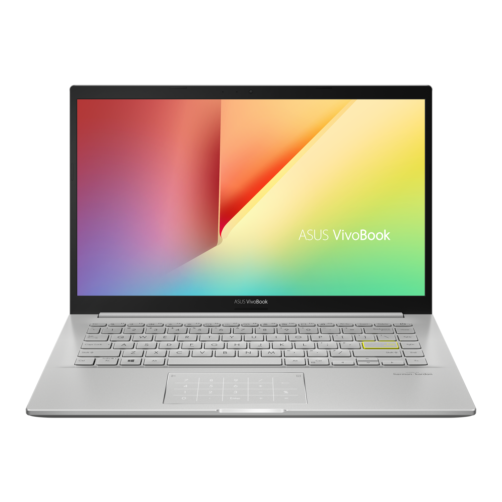
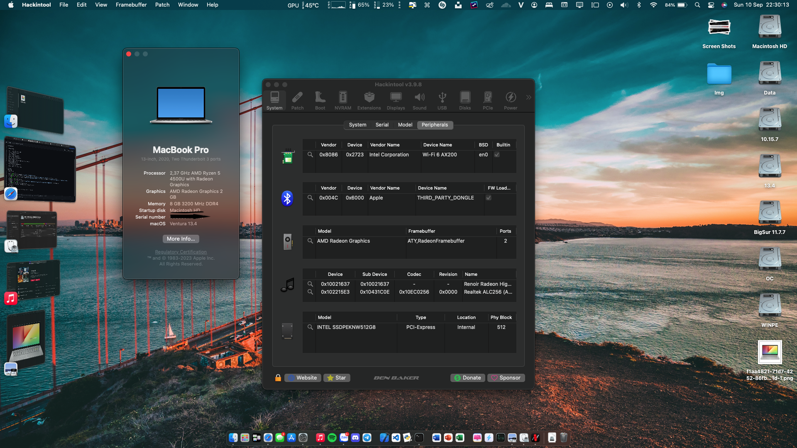

<h1 align="center">(WIP) Hackintosh for ASUS M413IA</h1>

  

# Getting Started

**Coming soon**

# Specification

| Hardware | Name |  
|    :---:     |    :---:   |
| Model  | Asus VivoBook M413IA EK480T |  
| Processor | AMD Ryzen® 5 4500U | 
| Ram | 8GB Onboard |
| Graphics | AMD Radeon® Vega 6 |
| Storage | Intel® SSDPEKNW512G8 |
| Wi-Fi Card | Intel® Wi-Fi 6 AX200 |
| Audio | Realtek ALC256 |
| Display | 14.0-inch FHD (1920 x 1080) IPS Non-Touch Screen |
| Touchpad | ELAN I2C Touchpad (ELAN WBF included) |
| Keyboard | PS2 Keyboard (ASUS ATKD) with no keyboard backlight |
| Card Reader | microSD Card Reader |
| Camera | VGA Web Camera 720p HD |
| Battery | 42WHrs, 3S1P, 3-cell Li-ion |

# Feature
## Working
| Name | Note |  
|    :---:     |    :---   |
| iGPU/APU | ✅ Worked with [NootedRed](https://github.com/ChefKissInc/NootedRed) |
| Audio | ✅ Both speaker and microphone worked but HDMI is not working (NRed) |
| Wifi and BlueTooth | ✅ Worked with [AirportItlwm](https://github.com/OpenIntelWireless/itlwm) and [IntelBluetoothFirmware](https://github.com/OpenIntelWireless/IntelBluetoothFirmware) |
| USB | ✅ |
| Function keys | ✅ F1/F2/F3/F4/F5/F6/F7/F8/F10/F12 and Fn+Esc worked |
| TouchPad | ✅ Worked with AMD support [Voodool I2C](https://github.com/VoodooI2C/VoodooI2C/commit/f9f703b760711e25bd094058ecb6f19dea52dc5f) kext from ChefKiss |
| Card reader, Type-C port | ✅ |
| Sleep | ✅ with some modifications to BIOS |
| Extra | Battery last for 2 hours, temperature often be between 45ºC to 65ºC |

## Not working
| Name | Note |  
|    :---:     |    :---   |
| Continuity feature | ❌ Only HandOff and some features are only work with Intel WiFi card |
| VCN 2 | ❌ VCN 2 (Video Core Next 2) which is not working but VCN 1 is, this is NRed bug refer to [this](https://github.com/ChefKissInc/NootedRed/issues/28) and [this](https://github.com/ChefKissInc/NootedRed/issues/158) |

## Function keys

> [!NOTE]
> Like when using Windows you can use Function keys without Fn+Fx since i've mapped it all
> - Fn+Esc is also working
> - F1: Mute
> - F2: Decrease volume
> - F3: Increase volume
> - F4: Decrease brightness
> - F5: Increase brightness
> - F6: On/Off Touchpad
> - F7: Limit Battery Charging 80%/100%
> - F8: Show Desktop
> - F10: On/Off Display
> - F12: Play/Pause

# Preview

## Hey since i was banned from ChefKissInc so i guess i'll public this thing, no more restriction and tbh that guy is very very arrogant and hope he will get karma soon
