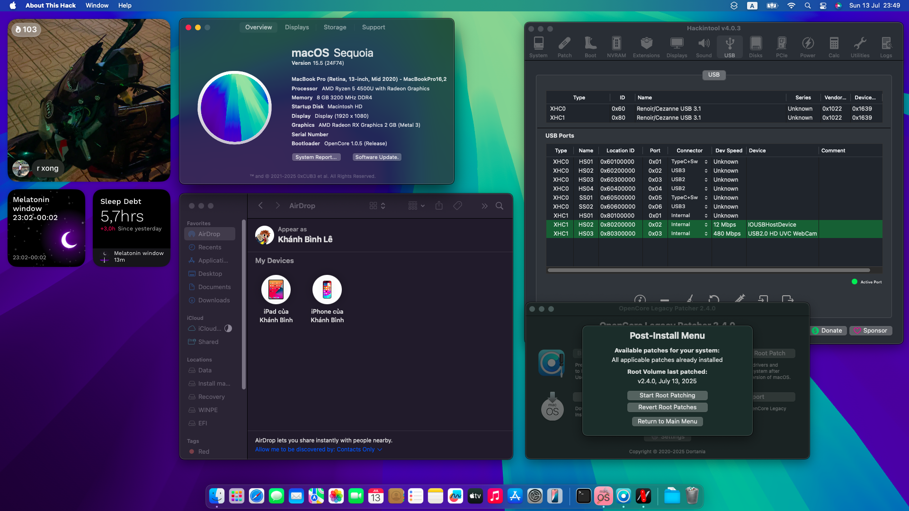

<h1 align="center">Hackintosh for ASUS M413IA</h1>

  

> [!NOTE]
> - This model contains a CNVi only key lock so it will never support **BCM94360NG**/or you have to buy a NVMe adapter (not tested). If you still want to have some continuity features, then try the DW series from Dell, like DW1560 or DW1820A.
# Specification

| Hardware | Name |  
|    :---:     |    :---:   |
| Model  | Asus VivoBook M413IA EK480T |  
| Processor | AMD Ryzen 5 4500U with Radeon Graphics | 
| Ram | 8GB Hynix onboard ram |
| Graphics | Renior APU aka AMD Radeon Vega 6 |
| Storage | Intel SSDPEKNW512G8 or SSD 660P Series |
| Wi-Fi Card | Intel Wi-Fi 6 AX200 |
| Audio | Realtek ALC256 |
| Display | 14.0-inch FHD (1920 x 1080) IPS Non-Touch Screen |
| Touchpad | ELAN I2C Touchpad (ELAN WBF included) |
| Keyboard | PS2 Keyboard with no keyboard backlight |
| Card Reader | microSD Card Reader |
| Camera | VGA Web Camera 720p HD |
| Battery | 42WHrs, 3S1P, 3-cell Li-ion |

## Extra Hardware
> [!NOTE]
> This hardware is not included in the default spec of M413IA.

| Hardware | Name |  Note |
|    :---:     |    :---:   |  :---:   |
| Storage | WDC PC SN730 SDBQNTY-512G-1001 | M413IA has 2 NVMe M.2 slots, so I filled the last M.2 slot with this. |
| Wi-Fi Card | Dell DW1820A (BCM94350ZAE) (not recommended to use) | Replacement for Intel Wi-Fi 6 AX200. |
# Features
## Working
| Name | Note |  
|    :---:     |    :---:   |
| SMBios | MacBookPro16,3 |
| iGPU/APU | ✅ Works with NootedRed |
| Audio | ✅ Both internal speaker and microphone work, but HDMI is not working (NRed) |
| WiFi and BlueTooth (Intel) | ✅ Works with AirportItlwm and IntelBluetoothFirmware |
| WiFi and BlueTooth (DW 1820A) | ✅ Works with AirportBrcmFixup and BcrmPatchRam |
| Continuity feature (DW 1820A) |✅ Only works with AirDrop, AirPlay, and partially HandOff |
| USB | ✅ Map with USBMap |
| Function keys | ✅ F1/F2/F3/F4/F5/F6/F7/F8/F10/F12 and Fn+Esc work |
| TouchPad | ✅ Works with AMD support Voodool I2C kext from ChefKiss |
| Card reader, Type-C port | ✅ |
| Sleep | ✅ with some modifications to BIOS, works like native Macs |
| Battery | ✅ Battery Health and Charging Limit feature |
| IOReg | Proper IOReg |
| Extra | Battery lasts for 2 hours, temperature often is between 45ºC to 65ºC |

## Not working
| Name | Note |  
|    :---:     |    :---:  |
| Apple DRM | ❌ Apple TV, anything that related to DRM |
| Continuity feature (Intel) | ❌ Only HandOff and some features only work with Intel WiFi card |
| VCN 2, HE, HD | ❌ VCN 2 (Video Core Next 2) is not working, but VCN 1 is |
| DW 1820A | ❌ Random kernel panic with AirportBrcmFixup, current workaround is set a delay for native kext |

## Function keys

> [!NOTE]
> Like when using Windows, you can use Function keys without Fn+Fx since I've mapped them all.
> - Fn+Esc is also working.
> - F1: Mute
> - F2: Decrease volume
> - F3: Increase volume
> - F4: Decrease brightness
> - F5: Increase brightness
> - F6: On/Off Touchpad
> - F7: Previous track
> - F8: Show Desktop
> - F9: N/A
> - F10: Play/Pause
> - F11: N/A
> - F12: Next track
> - Fn + Space: Limit 80%/100% battery charge

# Preview

